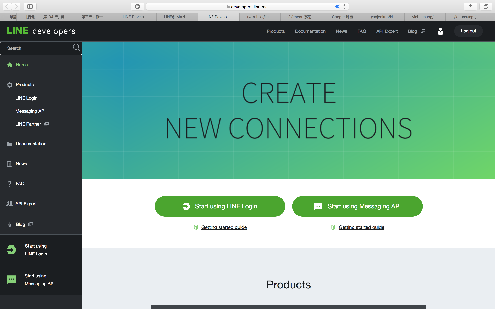
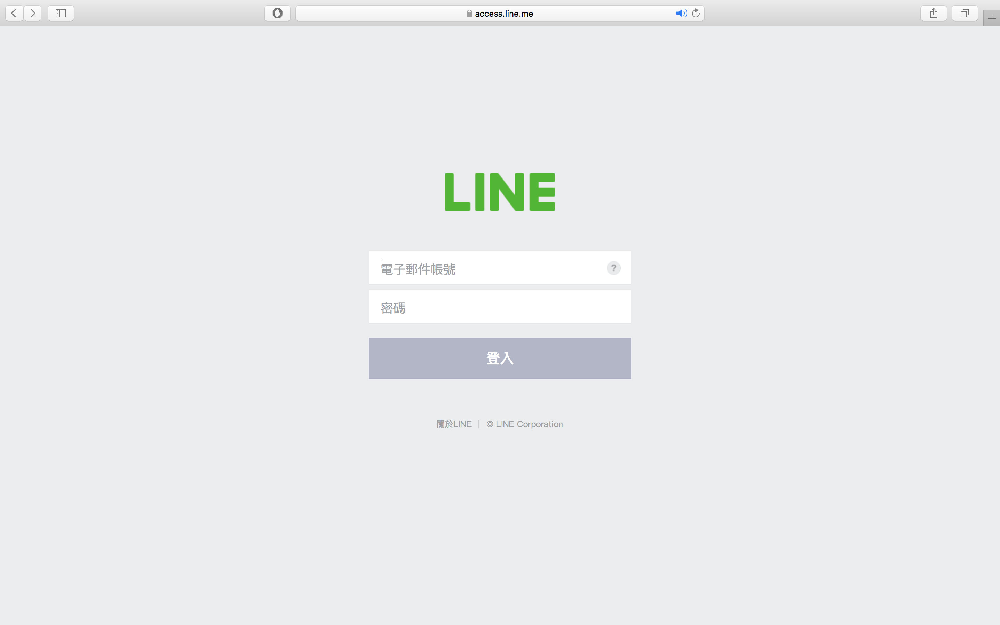
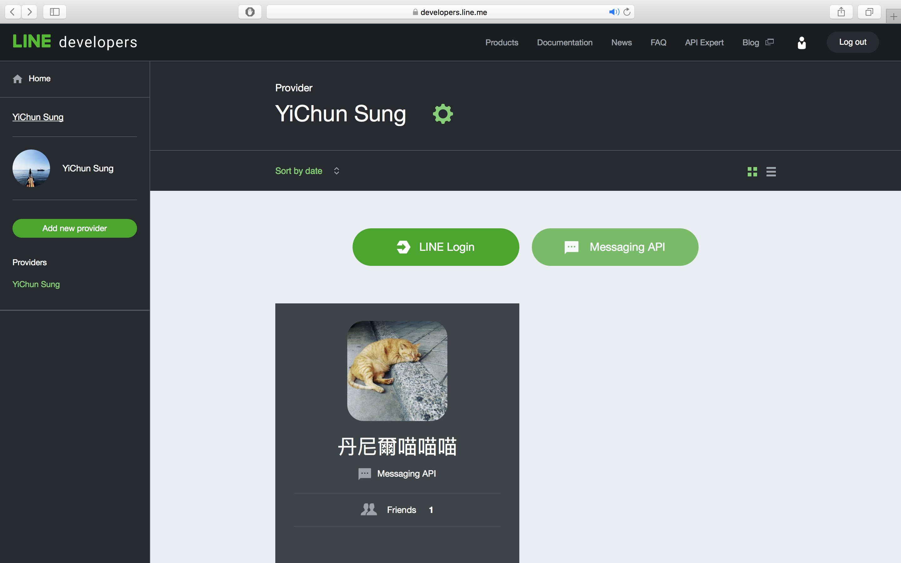
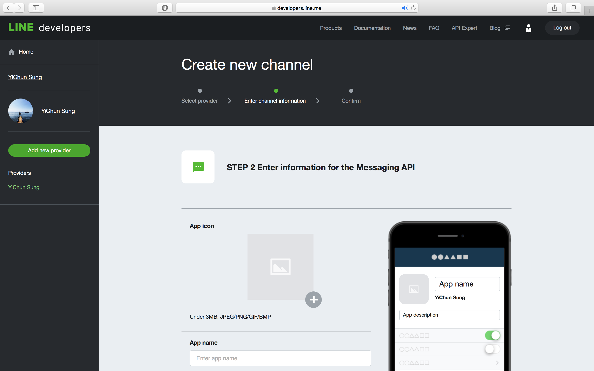
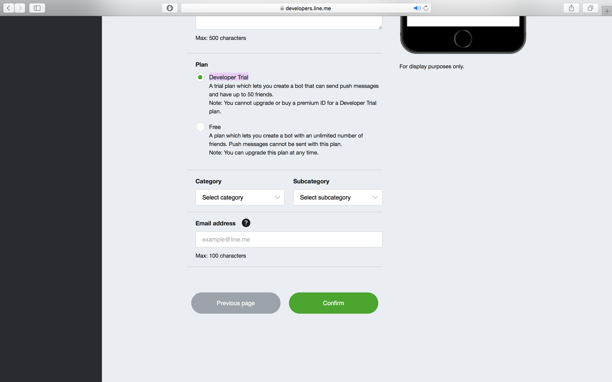
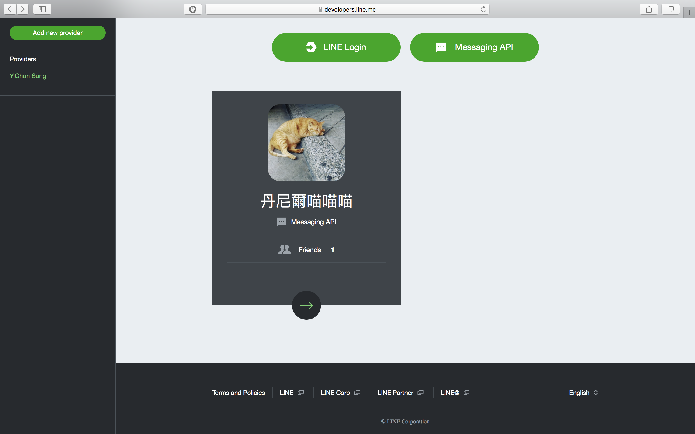
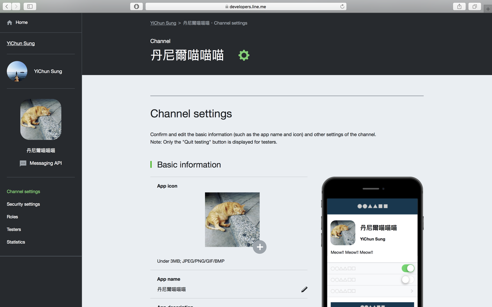
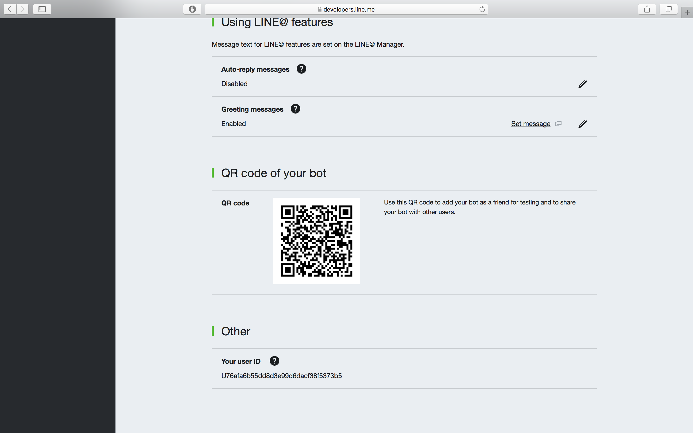
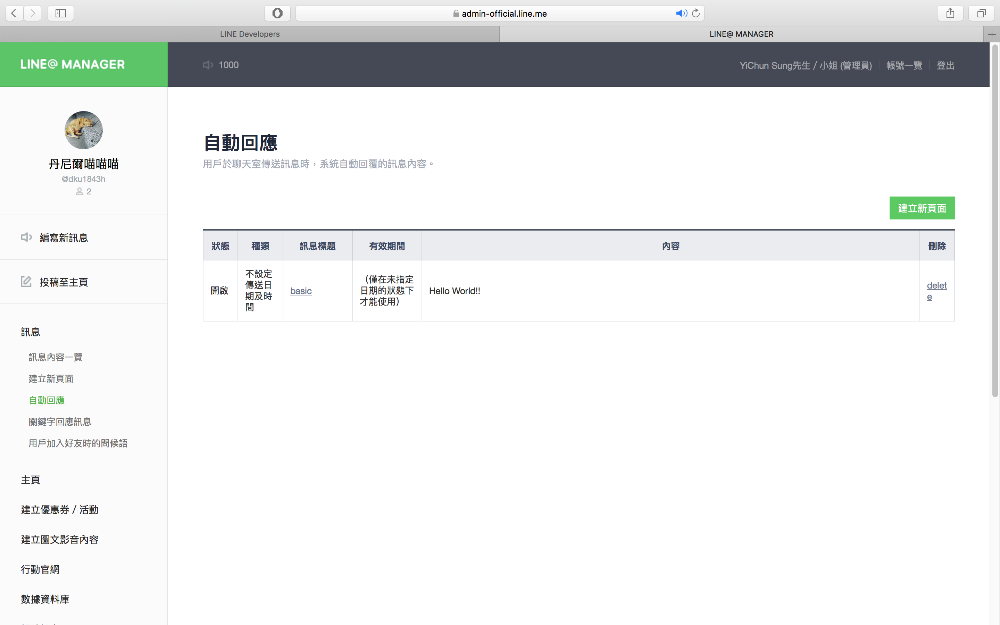
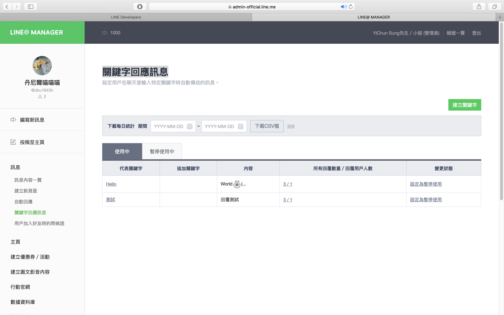

# LineBOT demo

## 在line上註冊專案，製作最簡單的Line機器人

1. 前往Line Developer 首頁

[Line Developer](https://developers.line.me/en/)

* 點選log in

* 登入後他會請你填一些註冊資料等等，照著填就好

* 資料填妥後便可以點選Messaging API建立第一個機器人

* 進入頁面後基本上填你想填的就好，唯一要注意的是Plan選項建議選擇Developer Trial，差別在於好友數上限50人，如果未來你想要持續發展的話只要付錢升級就好。

* 當你輸入完成後並且經過層層的確認後，你可以發現你就建立了一隻機器人了。

---

2. 設定這隻line 機器人

* 點進去你新創造的機器人。

* 拉到最下面就可以看到QRCODE，加入的方法和line新增好友相同。

* 接著我們找到Using LINE@ features中的Auto-reply messages，啟用後點選Set message進去編輯簡單的自動回覆訊息功能。

* 自動回應就是隨便打一個訊息他會回覆你固定的訊息，左邊選單也可以去“關鍵字回應訊息”去設定關鍵字回覆特別的訊息。

* 至此，你已經可以利用line中後台建立一些簡單的功能(對於很多人來說已經夠用)，進階版要coding的部分後面再慢慢更新。